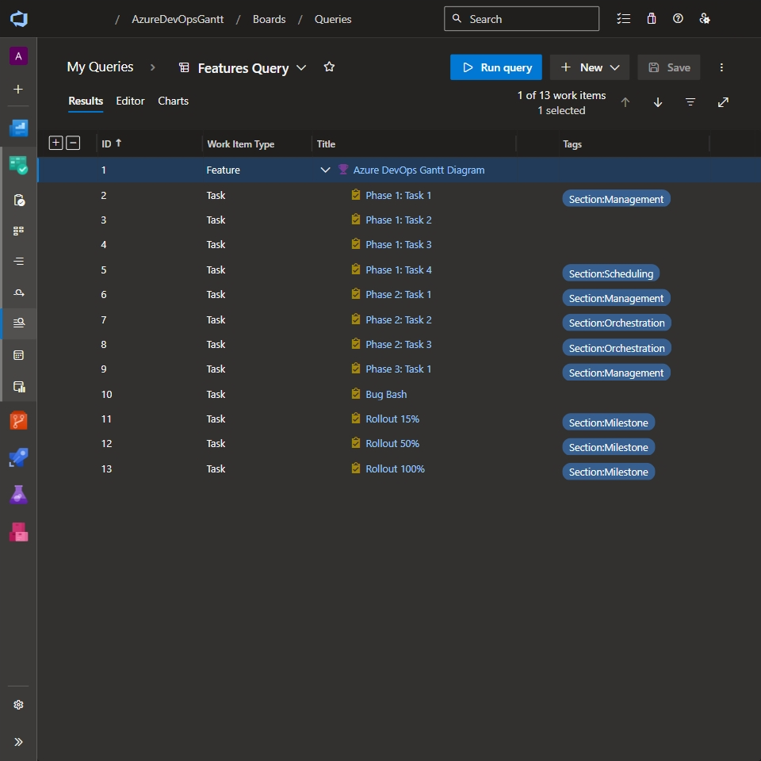
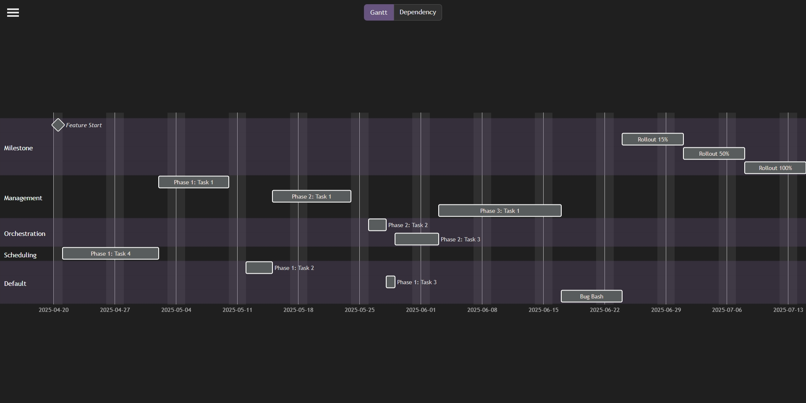
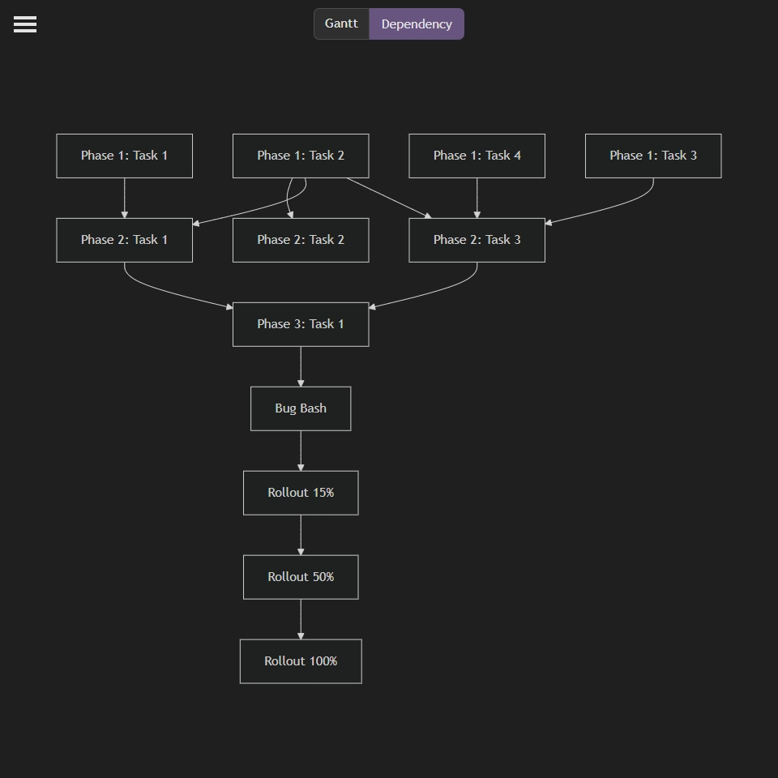
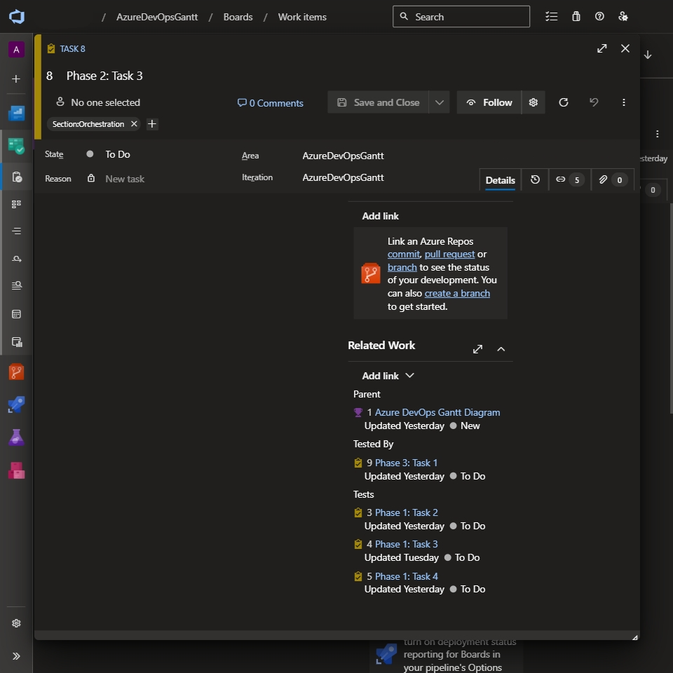
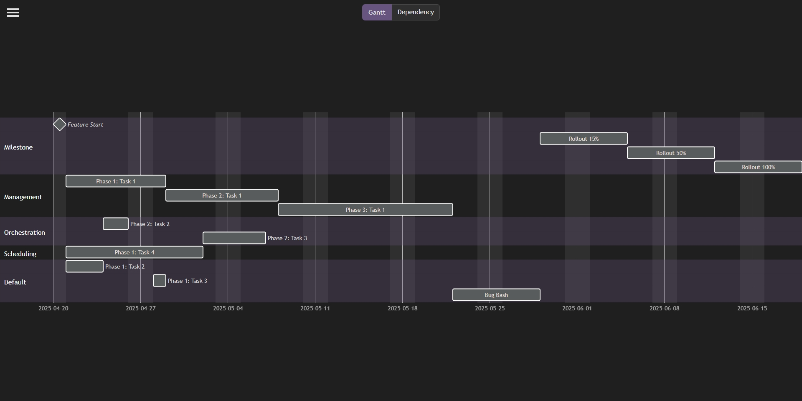

# Azure DevOps Gantt

**Azure DevOps Gantt (A-DOG)** is a tool used to generate a [Mermaid JS](https://mermaid.js.org/) [Gantt Diagram](https://mermaid.js.org/syntax/gantt.html) from an Azure DevOps Feature work item and its child work items.

## Screenshots

Turn Azure DevOps Feature | Into Gantt Diagram | Using Dependency Diagram
:---: | :---: | :---:
 | _(w/ 1 Resource completion date is 2025-07-14)_  | 
 | _(w/ 3 Resources completion date is 2025-06-19)_  | &nbsp;

## How to Use

This guide assumes that you already have access to an Azure DevOps organization, project and work items and are able to create Personal Access Tokens with a _Work Items (Read)_ scope. If you do not and would like to still use the tool, you can setup a free Azure DevOps [Organization](https://learn.microsoft.com/en-us/azure/devops/organizations/accounts/create-organization), [Project](https://learn.microsoft.com/en-us/azure/devops/organizations/projects/create-project) and [Work Items](https://learn.microsoft.com/en-us/azure/devops/boards/work-items/view-add-work-items) using the linked docs.

1. Create a dependency hierarchy using the Azure DevOps Related Work Links, placing the dependency link type on child work items. By default the dependency link type is _Tests_ but is configurable in the tool. If you are unsure of how to assign work item links, please see the [Azure DevOps Work Item Links](https://learn.microsoft.com/en-us/azure/devops/boards/backlogs/add-link#link-a-work-item-to-another-work-item) doc. See also the [Configuration Options](#configuration-options) section _Dependency Relation_ setting for an example.
1. Create a new Personal Access Token with a _Work Items (Read)_ scope. If you do not know how to create a Personal Access Token, please see the [Azure DevOps Create a PAT](https://learn.microsoft.com/en-us/azure/devops/organizations/accounts/use-personal-access-tokens-to-authenticate#create-a-pat) doc.
1. Navigate to this repository's [GitHub Pages](https://onyxnox.github.io/AzureDevOpsGantt/).
1. If you have never visited the tool, the _Control Panel_ will be automatically opened, enter the context details and update any default settings to fit your Azure DevOps environment.
1. Click on the _Generate_ button at the bottom of the _Control Panel_.

## Configuration Options

<table>
    <tr>
        <th>Setting</th>
        <th>Description</th>
    </tr>
    <tr><th colspan="2">Context Settings</th></tr>
    <tr>
        <td><b>Organization Name</b></td>
        <td>Name of the Azure DevOps organization the feature to be diagramed is under.</td>
    </tr>
    <tr>
        <td><b>Project Name</b></td>
        <td>Name of the Azure DevOps organization project the feature to be diagramed is under.</td>
    </tr>
    <tr>
        <td><b>Feature Work Item ID</b></td>
        <td>Identifier of the Azure DevOps Feature work item to be diagramed.</td>
    </tr>
    <tr>
        <td><b>User Email</b></td>
        <td>Email address of the Azure DevOps user used to authenticate requests.</td>
    </tr>
    <tr>
        <td><b>Personal Access Token</b></td>
        <td>Personal Access Token generated by Azure DevOps used to authenticate requests.</td>
    </tr>
    <tr><th colspan="2">Settings</th></tr>
    <tr>
        <td><b>Resource Count</b></td>
        <td>Number of people (resources) to be assigned to the feature.</td>
    </tr>
    <tr>
        <td><b>Dependency Relation</b></td>
        <td>
            Azure DevOps work item relationship (link) type that identifies the parent work item.
             
            <b>Example:</b> If we have <i>WorkItemA</i> and <i>WorkItemB</i>, and <i>WorkItemB</i>
            depends on <i>WorkItemA</i> to be completed first; we would expect the dependency link
            type of <i>Tests</i> to be placed on <i>WorkItemB</i>.
        </td>
    </tr>
    <tr>
        <td><b>Section Tag Prefix</b></td>
        <td>
            Azure DevOps work item tag prefix that identifies the work item's domain and the section it is listed under. If no section is specified <i>Default</i> is assigned.
             
            <b>Example:</b> A section tag prefix of <i>Section:</i> with a work item tag of
            <i>Section:Configuration</i> would result in the work item being listed under the
            <i>Configuration</i> section.
        </td>
    </tr>
    <tr><th colspan="2">Field Settings</th></tr>
    <tr>
        <td><b>Effort Field</b></td>
        <td>
            Name of the work item field that contains the estimated amount of time it will take to complete it.
        </td>
    </tr>
    <tr>
        <td><b>Effort Measurement</b></td>
        <td>
            <i>Effort Field</i>'s unit of measurement.
             
            <b>Supported Units:</b> Days, Hours, Minutes, Weeks
        </td>
    </tr>
    <tr>
        <td><b>Priority Field</b></td>
        <td>Name of the work item field that contains the priority of it.</td>
    </tr>
</table>

## Q&A

### 1. How are work items scheduled on the gantt diagram?

Work items are scheduled based on the dependency hierarchy and sorted by priority ascending then by effort descending. Parallel task execution is restricted by the defined _Resource Count_.

## To Dos

1. Extend the gantt diagram functionality to accommodate work items that exceed their estimated effort.
1. Introduce "Abstract" as an effort unit option, allowing users to define a custom ratio between days and effort (e.g. 1 day = 1.5 effort or 1:1.5).
1. Enable users to integrate an Outlook calendar, allowing blockers to indicate periods where no progress will be made on assigned work items.
1. Enable users to add an Azure DevOps backlog instead of a single feature, allowing for seamless navigation through backlog items and providing a clear view of their status and progression.
1. Implement caching for Azure DevOps and Microsoft Graph clients to reduce unnecessary calls on each edit. Instead of in-memory caching—given the verbosity of work items and entities—utilize IndexedDB for storage.
1. Enable users to modify work item history by adding a JSON payload within a \`\`\`adog\`\`\` code block in the comments. This allows adjustments for discrepancies between recorded progress and actual work—whether due to an absence, oversight or other unexpected factors.
1. Allow users to maintain multiple saved configurations, including context, settings, and other preferences.
1. Simulate the projected timeline by utilizing the As Of field to indicate which items should be in progress or completed based on the specified date.
1. Apply a background color gradient to work items based on their state durations, visually representing their progression over time. Additionally, provide users with a toggle option to display only the current status, allowing for a clearer, more focused view when needed.
1. Explore a method to integrate resource-specific blockers into the Outlook calendar, such as on-call shifts. This data will enable both timelines to accurately reflect periods where no progress can be made on assigned work items for specific resources.
1. Provide an option for automatic refresh, ensuring the diagram updates in real time as changes occur in the Azure DevOps feature.
1. Add customization options for the tool’s primary color and gantt diagram colors, giving users greater control over visual styling.

## Current Goal

The code is currently unpolished, a bit repetitive, and likely has room for optimization. However, as with most projects, my priority is to implement the majority of the [To Do](#to-dos) features first before refining the user interface or optimizing the code. Once the core functionality is complete, I'll shift focus to cleanup, refactoring, and polishing.